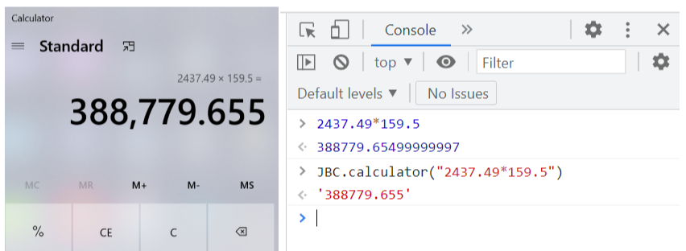

# JSBI-Calculator

JSBI-Calculator is a calculator utility to perform arbitrary arithmetic computation, with the help of JSBI-based BigDecimal.

## Installation

```
> npm install jsbi-calculator
```

## Showcase



## Usage

> For module:

```js
import JBC from "jsbi-calculator";

const { calculator } = JBC;

const expressionOne = "((10 * (24 / ((9 + 3) * (-2)))) + 17) + 5";
const resultOne = calculator(expressionOne);
console.log(resultOne);
// -> '12'

const max = String(Number.MAX_SAFE_INTEGER);
console.log(max);
// -> '9007199254740991'
const expressionTwo = `${max} + 2`;
const resultTwo = calculator(expressionTwo);
console.log(resultTwo);
// -> '9007199254740993'
```

> For node:

```js
const JBC = require("jsbi-calculator");

const { calculator } = JBC;

const expressionOne = "((10 * (24 / ((9 + 3) * (-2)))) + 17) + 5";
const resultOne = calculator(expressionOne);
console.log(resultOne);
// -> '12'

const max = String(Number.MAX_SAFE_INTEGER);
console.log(max);
// -> '9007199254740991'
const expressionTwo = `${max} + 2`;
const resultTwo = calculator(expressionTwo);
console.log(resultTwo);
// -> '9007199254740993'
```

> For browser:

```html
<!DOCTYPE html>
<html lang="en">
  <head>
    <meta charset="UTF-8" />
    <meta http-equiv="X-UA-Compatible" content="IE=edge" />
    <meta name="viewport" content="width=device-width, initial-scale=1.0" />
    <title>Jsbi-calculator Test</title>
    <script src="https://cdn.jsdelivr.net/npm/jsbi-calculator/dist/jsbi-calculator-umd.js"></script>
  </head>
  <body></body>
  <script type="text/javascript">
    const expressionOne = "((10 * (24 / ((9 + 3) * (-2)))) + 17) + 5";
    const resultOne = JBC.calculator(expressionOne);
    console.log(resultOne);
    // -> '12'

    const userAgent = navigator.userAgent;
    const isIE11 =
      userAgent.indexOf("Trident") > -1 && userAgent.indexOf("rv:11.0") > -1;
    let max;
    // MAX_SAFE_INTEGER not available in IE11
    max = isIE11 ? "9007199254740991" : String(Number.MAX_SAFE_INTEGER);

    console.log(max);
    // -> '9007199254740991'
    const expressionTwo = max + " + 2";
    const resultTwo = JBC.calculator(expressionTwo);
    console.log(resultTwo);
    // -> '9007199254740993'
  </script>
</html>
```

## Note

The following operations are available. Please mind the factors which are
negative must start with "-" and be surrounded by parentheses, e.g. (-11) and
the positive ones can not start with "+".

| Operation      | Symbol |
| -------------- | ------ |
| Addition       | `+`    |
| Subtration     | `-`    |
| Multiplication | `*`    |
| Division       | `/`    |

## Under the hood
